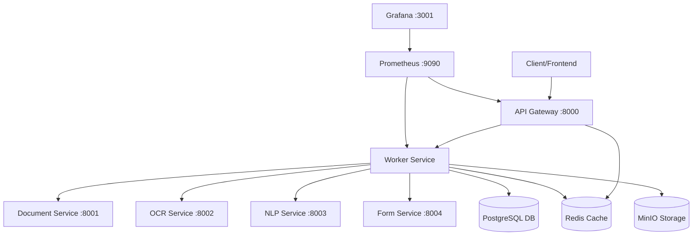

# ClaimEase - Automated Prior Authorization Form Filling System

[](https://www.docker.com/)
[](https://www.python.org/)
[](https://fastapi.tiangolo.com/)
[](LICENSE)

**Intelligent microservices-based system for automating healthcare Prior Authorization (PA) form processing using AI/ML technologies**

## 🎯 Project Overview

ClaimEase revolutionizes the healthcare Prior Authorization workflow by automating the traditionally manual process of filling PA forms. The system intelligently extracts information from referral packages and automatically populates the corresponding PA forms, significantly reducing processing time and human error.

### **What ClaimEase Does**
- 🔍 **Intelligent Document Processing**: Automatically processes PA forms and referral packages
- 🤖 **AI-Powered Text Extraction**: Uses EasyOCR to extract text from scanned medical documents
- 🧠 **Smart Entity Recognition**: Employs spaCy NLP for medical entity identification and mapping
- 📋 **Automated Form Filling**: Fills PA forms with extracted patient information
- 📊 **Comprehensive Reporting**: Generates detailed reports for missing information
- 🏗️ **Scalable Architecture**: Built with microservices for high availability and performance

### **Key Features**
- ✅ **Complete Automation Pipeline**: PDF upload → OCR → NLP → Form Filling → Output
- ✅ **Microservices Architecture**: 6 specialized services with Redis-based communication
- ✅ **AI/ML Integration**: EasyOCR + spaCy for intelligent document understanding
- ✅ **Real-time Processing**: Background job processing with progress tracking
- ✅ **Monitoring & Observability**: Prometheus + Grafana for system monitoring
- ✅ **Multi-format Support**: Handles both widget-based and non-widget PDF forms
- ✅ **Healthcare Compliance**: Designed with healthcare data standards in mind

## � Table of Contents

- [Installation & Setup](#-installation--setup)
- [Quick Start](#-quick-start)
- [Architecture](#️-architecture)
- [Technologies Used](#-technologies-used)
- [API Documentation](#-api-documentation)
- [Examples](#-examples)
- [Development](#-development)
- [Monitoring](#-monitoring)
- [Contributing](#-contributing)
- [License](#-license)
- [Support](#-support)

## 🚀 Installation & Setup

### **Prerequisites**
- **Docker** and **Docker Compose** (v20.10+ recommended)
- **Git** for version control
- **WSL2** (for Windows users)
- At least **4GB RAM** and **10GB free disk space**

### **Installation Steps**

1. **Clone the Repository**
   ```bash
   git clone https://github.com/yourusername/ClaimEase.git
   cd ClaimEase
   ```

2. **Environment Setup**
   ```bash
   # Make scripts executable (Linux/WSL)
   chmod +x precheck.sh start.sh test.sh
   
   # Run pre-installation checks
   ./precheck.sh
   ```

3. **Start Services**
   ```bash
   # Start all services with Docker Compose
   docker-compose up -d
   
   # Verify all services are running
   docker-compose ps
   ```

4. **Health Check**
   ```bash
   # Check API Gateway health
   curl http://localhost:8000/health
   
   # Monitor service logs
   docker-compose logs -f
   ```

### **Quick Installation (One Command)**
```bash
# Clone, build, and start everything
git clone https://github.com/yourusername/ClaimEase.git && cd ClaimEase && chmod +x start.sh && ./start.sh
```

## 🎯 Quick Start

### **Processing Your First PA Form**

1. **Upload Documents**
   Place your PA form and referral package in the appropriate patient folder:
   ```
   data/input/Input Data/PatientName/
   ├── PA.pdf
   └── referral_package.pdf
   ```

2. **Start Processing**
   ```bash
   # Process a specific patient
   curl -X POST http://localhost:8000/api/v1/patients/Amy/process
   
   # Or use the start script
   ./start.sh Amy
   ```

3. **Monitor Progress**
   ```bash
   # Check job status
   curl -X GET http://localhost:8000/api/v1/jobs/{job_id}/status
   
   # View processing logs
   docker-compose logs -f worker
   ```

4. **Retrieve Results**
   Check the `data/output/PatientName/` folder for:
   - `filled_pa_form.pdf` - Completed PA form
   - `missing_fields_report.txt` - Report of unfilled fields
   - Processing logs and intermediate data

### **Web Interface**
Visit `http://localhost:3000` for the web-based interface (if frontend is deployed).

## 🏗️ Architecture

### **System Overview**


### **Microservices Architecture**

| Service | Port | Purpose | Technologies |
|---------|------|---------|-------------|
| **API Gateway** | 8000 | Authentication, routing, rate limiting | FastAPI, Redis |
| **Document Service** | 8001 | PDF analysis and preprocessing | PyMuPDF, FastAPI |
| **OCR Service** | 8002 | Text extraction from scanned documents | EasyOCR, Pillow |
| **NLP Service** | 8003 | Entity recognition and information extraction | spaCy, FastAPI |
| **Form Service** | 8004 | PDF form filling and generation | PyMuPDF, FastAPI |
| **Worker Service** | - | Background job orchestration | Celery, Redis |

### **Data Flow**
1. **Document Upload** → Document analysis and validation
2. **OCR Processing** → Text extraction with EasyOCR (300 DPI optimization)
3. **NLP Processing** → Medical entity recognition and extraction
4. **Form Mapping** → Intelligent field mapping (27+ fields supported)
5. **Form Filling** → PDF generation with extracted data
6. **Report Generation** → Missing information analysis and reporting

## 💻 Technologies Used

### **Backend & Core**
- **Python 3.12** - Primary programming language
- **FastAPI 0.104.1** - Modern, fast web framework for APIs
- **Uvicorn** - ASGI server for FastAPI applications
- **Pydantic** - Data validation and settings management
- **SQLAlchemy 2.0** - Database ORM
- **Asyncpg** - Async PostgreSQL adapter

### **AI & Machine Learning**
- **EasyOCR 1.7.0** - Optical Character Recognition
- **spaCy** - Natural Language Processing and entity recognition
- **PyMuPDF 1.23.8** - PDF processing and manipulation
- **Pillow** - Image processing
- **NumPy** - Numerical computations

### **Infrastructure & Storage**
- **PostgreSQL 15** - Primary database
- **Redis 7** - Caching and message broker
- **MinIO** - Object storage (S3-compatible)
- **Docker & Docker Compose** - Containerization and orchestration

### **Monitoring & Observability**
- **Prometheus** - Metrics collection and monitoring
- **Grafana** - Visualization and dashboards
- **Prometheus Client** - Application metrics

### **Queue & Background Processing**
- **Celery** - Distributed task queue
- **Redis** - Message broker for Celery

### **Security & Authentication**
- **Python-JOSE** - JWT token handling
- **Passlib** - Password hashing
- **Cryptography** - Security utilities

## 📋 API Documentation

### **Core Endpoints**

#### **Health Check**
```http
GET /health
```
Returns system health status and service availability.

#### **Patient Processing**
```http
POST /api/v1/patients/{patient_name}/process
```
Initiates PA form processing for a specific patient.

**Example:**
```bash
curl -X POST http://localhost:8000/api/v1/patients/Amy/process \
  -H "Content-Type: application/json"
```

#### **Job Status**
```http
GET /api/v1/jobs/{job_id}/status
```
Retrieves the current status of a processing job.

#### **File Upload**
```http
POST /api/v1/upload
```
Upload PA forms and referral packages.

### **Interactive API Documentation**
- **Swagger UI**: http://localhost:8000/docs
- **ReDoc**: http://localhost:8000/redoc

## 📊 Examples

### **Example 1: Processing Amy's Documents**

1. **Input Structure:**
   ```
   data/input/Input Data/Amy/
   ├── PA.pdf (Prior Authorization form)
   └── referral_package.pdf (Medical documents)
   ```

2. **Processing Command:**
   ```bash
   curl -X POST http://localhost:8000/api/v1/patients/Amy/process
   ```

3. **Generated Output:**
   ```
   data/output/Amy/
   ├── filled_pa_form.pdf           # Completed PA form
   ├── missing_fields_report.txt    # Missing information report
   └── processing_log.json          # Detailed processing log
   ```

### **Example 2: Batch Processing**
```bash
# Process multiple patients
for patient in Amy Akshay Adbulla; do
  echo "Processing $patient..."
  curl -X POST http://localhost:8000/api/v1/patients/$patient/process
  sleep 5
done
```

### **Example 3: Monitoring with Logs**
```bash
# Watch processing in real-time
docker-compose logs -f worker ocr-service nlp-service

# Check specific service logs
docker-compose logs form-service
```

### **Sample Output Report**
```
ClaimEase Processing Report
==========================
Patient: Amy Johnson
Processing Date: 2025-06-18 14:30:25
Status: Completed

Filled Fields (18/27):
✅ Patient Name: Amy Johnson
✅ Date of Birth: 1985-03-15
✅ Insurance ID: INS123456789
✅ Diagnosis: Rheumatoid Arthritis
✅ Requested Medication: Humira
... (additional fields)

Missing Fields (9/27):
❌ Prior Authorization Number
❌ Prescriber NPI
❌ Secondary Insurance
... (additional missing fields)

Processing Time: 45.2 seconds
OCR Confidence: 94.3%
NLP Entities Extracted: 23
```

## 🛠️ Development

### **Development Setup**

1. **Clone for Development**
   ```bash
   git clone https://github.com/yourusername/ClaimEase.git
   cd ClaimEase
   
   # Create development branch
   git checkout -b feature/your-feature-name
   ```

2. **Local Development Environment**
   ```bash
   # Install Python dependencies locally (optional)
   pip install -r services/api-gateway/requirements.txt
   
   # Start services in development mode
   docker-compose -f docker-compose.dev.yml up
   ```

3. **Running Tests**
   ```bash
   # Run all tests
   ./test.sh
   
   # Run specific service tests
   docker-compose exec api-gateway python -m pytest
   ```

### **Project Structure**
```
ClaimEase/
├── services/                    # Microservices
│   ├── api-gateway/            # Main API gateway
│   ├── document-service/       # PDF processing
│   ├── ocr-service/           # Text extraction
│   ├── nlp-service/           # Entity recognition
│   ├── form-service/          # Form filling
│   └── worker/                # Background tasks
├── data/                      # Data directories
│   ├── input/                 # Input documents
│   ├── output/                # Generated outputs
│   └── models/                # ML models
├── docs/                      # Documentation
├── monitoring/                # Monitoring configs
├── nginx/                     # Reverse proxy config
├── scripts/                   # Utility scripts
└── docker-compose.yml         # Container orchestration
```

### **Code Style & Standards**
- **Python**: Follow PEP 8 style guidelines
- **Linting**: Use `flake8` and `black` for code formatting
- **Type Hints**: Use type annotations throughout
- **Documentation**: Document all functions and classes
- **Testing**: Write unit tests for all new features

## 📈 Monitoring

### **Access Monitoring Dashboards**
- **Prometheus**: http://localhost:9090
- **Grafana**: http://localhost:3001
  - Username: `admin`
  - Password: `admin`

### **Key Metrics Monitored**
- **System Metrics**: CPU, Memory, Disk usage
- **Application Metrics**: Request latency, error rates
- **Processing Metrics**: OCR accuracy, processing time
- **Business Metrics**: Forms processed, success rates

### **Health Checks**
```bash
# Check all services
curl http://localhost:8000/health

# Individual service health
curl http://localhost:8001/health  # Document service
curl http://localhost:8002/health  # OCR service
curl http://localhost:8003/health  # NLP service
curl http://localhost:8004/health  # Form service
```

## 🤝 Contributing

We welcome contributions to ClaimEase! Please follow these guidelines:

### **Getting Started**
1. **Fork the repository** on GitHub
2. **Create a feature branch** from `main`
   ```bash
   git checkout -b feature/amazing-feature
   ```
3. **Make your changes** following our coding standards
4. **Write tests** for new functionality
5. **Update documentation** as needed

### **Development Workflow**
```bash
# 1. Fork and clone
git clone https://github.com/yourusername/ClaimEase.git
cd ClaimEase

# 2. Create feature branch
git checkout -b feature/your-feature-name

# 3. Make changes and test
docker-compose up -d
./test.sh

# 4. Commit changes
git add .
git commit -m "feat: add amazing feature"

# 5. Push and create PR
git push origin feature/your-feature-name
```

### **Contribution Guidelines**
- **Code Quality**: Follow PEP 8 style guidelines
- **Testing**: Include unit tests for new features
- **Documentation**: Update README and docs as needed
- **Commit Messages**: Use conventional commit format
- **Pull Requests**: Provide clear description of changes

### **Types of Contributions**
- 🐛 **Bug Fixes**: Fix existing issues
- ✨ **New Features**: Add new functionality
- 📚 **Documentation**: Improve documentation
- 🎨 **UI/UX**: Enhance user interface
- ⚡ **Performance**: Optimize system performance
- 🔒 **Security**: Improve security measures

### **Reporting Issues**
- Use GitHub Issues to report bugs
- Include system information and steps to reproduce
- Provide sample documents when relevant (anonymized)

### **Code Review Process**
1. All changes require peer review
2. Automated tests must pass
3. Documentation must be updated
4. Security review for sensitive changes

## 📄 License

This project is licensed under the **MIT License** - see the [LICENSE](LICENSE) file for details.

```
MIT License

Copyright (c) 2025 ClaimEase Contributors

Permission is hereby granted, free of charge, to any person obtaining a copy
of this software and associated documentation files (the "Software"), to deal
in the Software without restriction, including without limitation the rights
to use, copy, modify, merge, publish, distribute, sublicense, and/or sell
copies of the Software, and to permit persons to whom the Software is
furnished to do so, subject to the following conditions:

The above copyright notice and this permission notice shall be included in all
copies or substantial portions of the Software.

THE SOFTWARE IS PROVIDED "AS IS", WITHOUT WARRANTY OF ANY KIND, EXPRESS OR
IMPLIED, INCLUDING BUT NOT LIMITED TO THE WARRANTIES OF MERCHANTABILITY,
FITNESS FOR A PARTICULAR PURPOSE AND NONINFRINGEMENT. IN NO EVENT SHALL THE
AUTHORS OR COPYRIGHT HOLDERS BE LIABLE FOR ANY CLAIM, DAMAGES OR OTHER
LIABILITY, WHETHER IN AN ACTION OF CONTRACT, TORT OR OTHERWISE, ARISING FROM,
OUT OF OR IN CONNECTION WITH THE SOFTWARE OR THE USE OR OTHER DEALINGS IN THE
SOFTWARE.
```

## 🆘 Support

### **Getting Help**
- 📖 **Documentation**: Check our [docs/](docs/) folder
- 💬 **GitHub Discussions**: Ask questions and share ideas
- 🐛 **Issues**: Report bugs on GitHub Issues
- 📧 **Email**: contact@claimease.dev (if available)

### **FAQ**

**Q: What file formats are supported?**
A: Currently supports PDF files for both PA forms and referral packages.

**Q: How accurate is the OCR?**
A: EasyOCR typically achieves 90-95% accuracy on high-quality scanned documents.

**Q: Can I process non-English documents?**
A: EasyOCR supports multiple languages, but medical entity recognition is optimized for English.

**Q: What happens if a field can't be filled?**
A: The system generates a detailed report listing all missing fields and their reasons.

**Q: Is patient data secure?**
A: Yes, all data is processed locally within Docker containers and can be configured for HIPAA compliance.

### **System Requirements**
- **Minimum**: 4GB RAM, 10GB storage, Docker support
- **Recommended**: 8GB RAM, SSD storage, multi-core CPU
- **Production**: Load balancer, persistent storage, monitoring

### **Troubleshooting**
- **Services won't start**: Check Docker daemon and available ports
- **OCR errors**: Verify document quality and supported formats
- **High memory usage**: Monitor with `docker stats` and adjust container limits
- **Network issues**: Check firewall settings and port availability

---

## 📈 Roadmap

### **Current Status** (June 18, 2025)
- ✅ **Core Pipeline**: Fully operational end-to-end processing
- ✅ **Microservices**: All services deployed and communicating
- ✅ **Monitoring**: Prometheus + Grafana observability
- 🔄 **Form Filling**: Continuous improvements for accuracy
- 🔄 **UI/UX**: Web interface development in progress

### **Upcoming Features**
- 🔮 **Machine Learning**: Custom models for medical entity recognition
- 🔮 **Multi-language**: Support for additional languages
- 🔮 **Batch Processing**: Parallel processing of multiple patients
- 🔮 **API v2**: Enhanced REST API with GraphQL support
- 🔮 **Mobile App**: Mobile interface for healthcare providers

---

**Built with ❤️ for healthcare providers worldwide**

*ClaimEase - Simplifying healthcare administration through intelligent automation*
